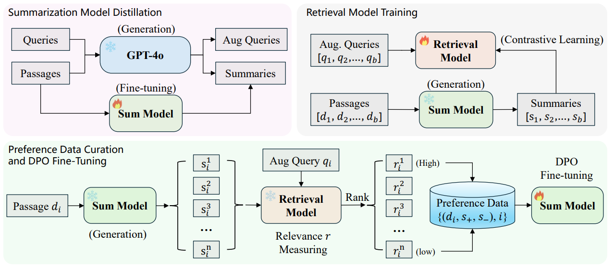
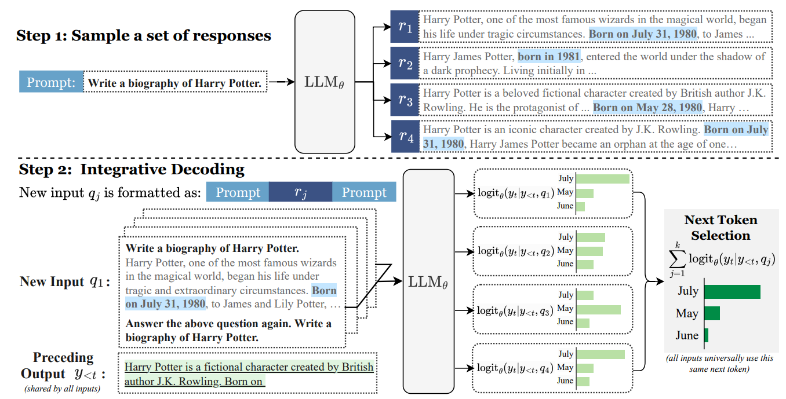
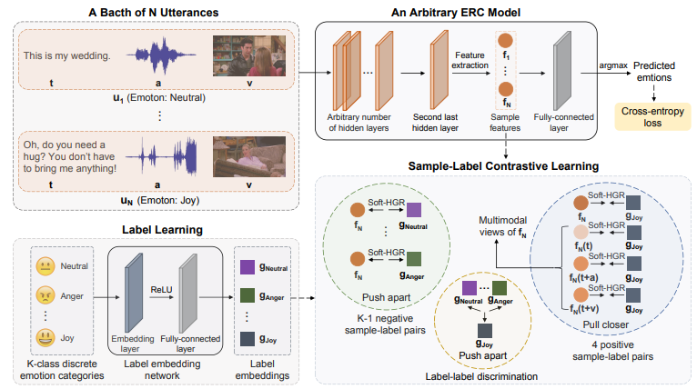
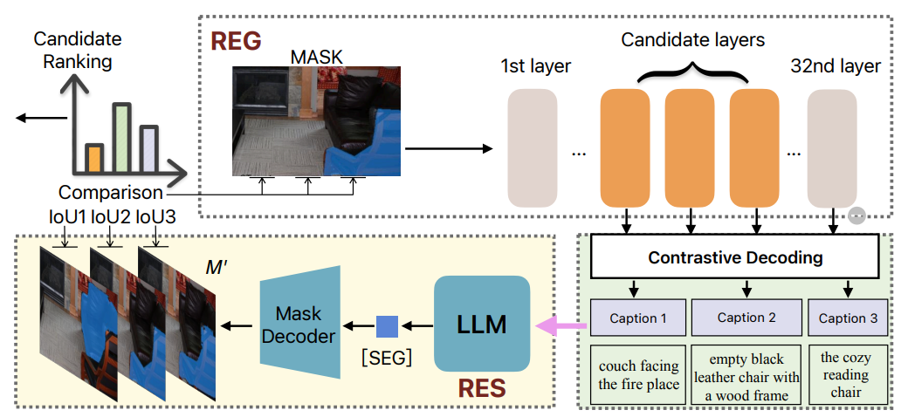

I am a third-year Master's student in Data Science at Tsinghua University, advised by Prof. [Shao-Lun Huang](https://sites.google.com/view/slhuang/home). Before that, I earned my B.S. in Electronic Engineering from Sun Yat-sen University (SYSU) in 2022, under the guidance of Prof. [Yulan Guo](http://www.yulanguo.cn/). Currently I'm a research intern at Microsoft Research Asia, working with Dr. [Yeyun Gong](https://www.microsoft.com/en-us/research/people/yegong/). I also interned at Tencent AI Lab, collaborating with Dr. [Pengyu Cheng](https://linear95.github.io/). 

My current research focuses on pre-training strategy and reinforcement learning (RL) for Large Language Models (LLMs), with a long-term aim at AGI. 
I am excited to apply for Fall 2025 PhD programs and investigate potential collaborations. If you are interested in discussing opportunities or have any questions, please feel free to [EMAIL](mailto:vitoliang0601@gmail.com) me. I genuinely appreciate your consideration and look forward to connecting with you.

  

📖Education
======
- **Aug. 2022 - Jun. 2025 (Expected)** M.Sc., Data Science and Information Technology, Tsinghua University, Beijing, China.
 *GPA: 3.98/4.0, Top 3%*

- **Sep. 2018 - Jun. 2022** B.Sc., Electronic Information Science and Technology, Sun Yat-sen University, Guangzhou, China.
 *GPA: 4.11/5.0, Top 3%*

  

📑Publications
======
<table style="width:100%;border:0px;border-spacing:0px;border-collapse:separate;margin-right:auto;margin-left:auto;" border="1" cellspacing="0" cellpadding="10"><tbody>	

  <!--Entity Sum-->
  <tr>
    <td style="padding:20px;width:30%;max-width:30%" align="center">
      
    </td>
    <td width="75%" valign="center">
      <papertitle>What You See Is What You Get: Entity-Aware Summarization for Reliable Sponsored Search</papertitle>
       
      <b>Xiao Liang</b>, Xinyu Hu, Simiao Zuo, Jimi He, Yu Wang, Victor Ye Dong, Yeyun Gong, Kushal S. Dave, Yi Liu, Qiang Lou, Shao-Lun Huang, Jian Jiao
       
      <em>NeurIPS 2024 SafeGenAi, </em> <a href="https://github.com/MasterVito/MasterVito.github.io/raw/master/_publications/NIPS_WS_2024_Entity_Sum_CR.pdf">[PDF]</a>
       
      
 We introduce a framework for generating reliable AI-driven entity-aware summaries for information retrieval in the sponsored search ads domain.

    </td>
  </tr>	

  <!--Integrative Decoding-->
  <tr>
    <td style="padding:20px;width:30%;max-width:30%" align="center">
      
    </td>
    <td width="75%" valign="center">
      <papertitle>Integrative Decoding: Improve Factuality via Implicit Self-consistency</papertitle>
       
      Yi Cheng, <b>Xiao Liang</b>, Yeyun Gong, Wen Xiao, Song Wang, Yuji Zhang, Wenjun Hou, Kaishuai Xu, Wenge Liu, Wenjie Li, Jian Jiao, Qi Chen, Peng Cheng, Wayne Xiong
       
      <em> Preprint 2024, </em> <a href="https://arxiv.org/abs/2410.01556">[PDF]</a>
       
      
 This paper presents a self-consistency based decoding strategy for improving the factual accuracy of large language models, especially in long-form generation tasks.

    </td>
  </tr>	

  <!--TRAIT-->
  <tr>
    <td style="padding:20px;width:30%;max-width:30%" align="center">
      
    </td>
    <td width="75%" valign="center">
      <papertitle>Task Oriented In-Domain Data Augmentation</papertitle>
       
      <b>Xiao Liang*</b> , Xinyu Hu*, Simiao Zuo, Yeyun Gong, Qiang Lou, Yi Liu, Shao-Lun Huang, Jian Jiao
       
      <em>EMNLP 2024, </em> <a href="https://arxiv.org/pdf/2406.16694">[PDF]</a>
       
      
 We propose a task-oriented in-domain data augmentation framework consisting of in-domain data selection and task-oriented synthetic passage generation.

    </td>
  </tr>	

  <!--DiffusionVG-->
  <tr>
    <td style="padding:20px;width:30%;max-width:30%" align="center">
      
    </td>
    <td width="75%" valign="center">
      <papertitle>Exploring Iterative Refinement with Diffusion Models for Video Grounding</papertitle>
       
      <b>Xiao Liang*</b>, Tao Shi*, Yaoyuan Liang, Te Tao, Shao-Lun Huang
       
      <em>ICME 2024, </em> <a href="https://arxiv.org/pdf/2310.17189">[PDF]</a> <a href="https://github.com/MasterVito/DiffusionVG">[Code]</a> 
       
      
 We propose a novel framework with diffusion models that formulates video grounding as a conditioned generation task, enhancing predictions through iterative refinement.

    </td>
  </tr>	

  <!--CoSTA-->
  <tr>
    <td style="padding:20px;width:30%;max-width:30%" align="center">
      
    </td>
    <td width="75%" valign="center">
      <papertitle>CoSTA: End-to-End Comprehensive Space-Time Entanglement for Spatio-Temporal Video Grounding</papertitle>
       
      Yaoyuan Liang*, <b>Xiao Liang*</b>, Yansong Tang, Zhao Yang, Ziran Li, Jingang Wang, Wenbo Ding, Shao-Lun Huang
       
      <em>AAAI 2024, </em> <a href="https://ojs.aaai.org/index.php/AAAI/article/download/28118/28240">[PDF]</a>
       
      
 We propose a framework of Comprehensive Space-Time entAnglement to densely entangle space-time multi-modal features for spatio-temporal localization.

    </td>
  </tr>	

  <!--SSLCL-->
  <tr>
    <td style="padding:20px;width:30%;max-width:30%" align="center">
      
    </td>
    <td width="75%" valign="center">
      <papertitle>SSLCL: An Efficient Model-Agnostic Supervised Contrastive Learning Framework for Emotion Recognition in Conversations</papertitle>
       
      Tao Shi*, <b>Xiao Liang*</b>, Yaoyuan Liang, Xinyi Tong, Shao-Lun Huang
       
      <em>Preprint 2023, </em> <a href="https://arxiv.org/pdf/2310.16676">[PDF]</a> <a href="https://github.com/TaoShi1998/SSLCL">[Code]</a> 
       
      
 We introduce utilizing label representations by projecting discrete labels into dense embeddings for multimodal emotion classification.

    </td>
  </tr>	

  <!--SimCAS-->
  <tr>
    <td style="padding:20px;width:30%;max-width:30%" align="center">
      
    </td>
    <td width="75%" valign="center">
      <papertitle>Chunk, Align, Select: A Simple Long-sequence Processing Method for Transformers</papertitle>
       
      Jiawen Xie, Pengyu Cheng, <b>Xiao Liang</b>, Yong Dai, Nan Du
       
      <em>ACL 2024, </em> <a href="https://arxiv.org/pdf/2308.13191">[PDF]</a> <a href="https://github.com/xjw-nlp/SimCAS">[Code]</a> 
       
      
 We propose a token selection framework for pre-trained transformers to process long sequences utilizing reinforcement learning.

    </td>
  </tr>

  <!--unleash-then-eliminate-->
  <tr>
    <td style="padding:20px;width:30%;max-width:30%" align="center">
      
    </td>
    <td width="75%" valign="center">
      <papertitle>Unleash Region Understanding in Intermediate Layers for MLLM-based Referring Expression Generation </papertitle>
       
      Yaoyuan Liang, Zhuojun Cai, Jian Xu, Guanbo Huang, Yiran Wang, <b>Xiao Liang</b>, Jiahao Liu, Ziran Li, Jingang Wang, Shao-Lun Huang
       
      <em>NeurIPS 2024, </em> [To be present]
       
      
 We present to elicit the latent information in intermediate layers adopt a cycle-consistency-based decoding method to alleviate hallucinations in the REG task. 

    </td>
  </tr>

</tbody></table>
(* indicates equal contribution)

🧑‍💻Experience
======
- (Nov. 2023 - Present) Reserch Intern, NLC Group, Microsoft Research Asia, Beijing, China.
  Mentor: [Yeyun Gong](https://www.microsoft.com/en-us/research/people/yegong/)
  Working on large language models, pre-training strategy and model architecture.

- (Mar. 2023 - Sep. 2023) Research Intern, AI Lab, Tencent Inc., Guangdong, China.
  Mentor: [Pengyu Cheng](https://linear95.github.io/), [Nan Du](https://scholar.google.com/citations?hl=en&user=BO4jEkAAAAAJ)
  Working on large language models, long sequence processing.

🏆Honors and Awards
======
- Outstanding Graduate Thesis, Sun Yat-sen University, Guangdong, 2022
- Outstanding Graduate Student, Sun Yat-sen University, Guangdong, 2022
- Second Prize Scholarship, Sun Yat-sen University, Guangdong, 2019~2022
- 1st of the 2022 Tsinghua Open Hack Competition - Multimodal Learning Track, Tsinghua University, Beijing, 2022